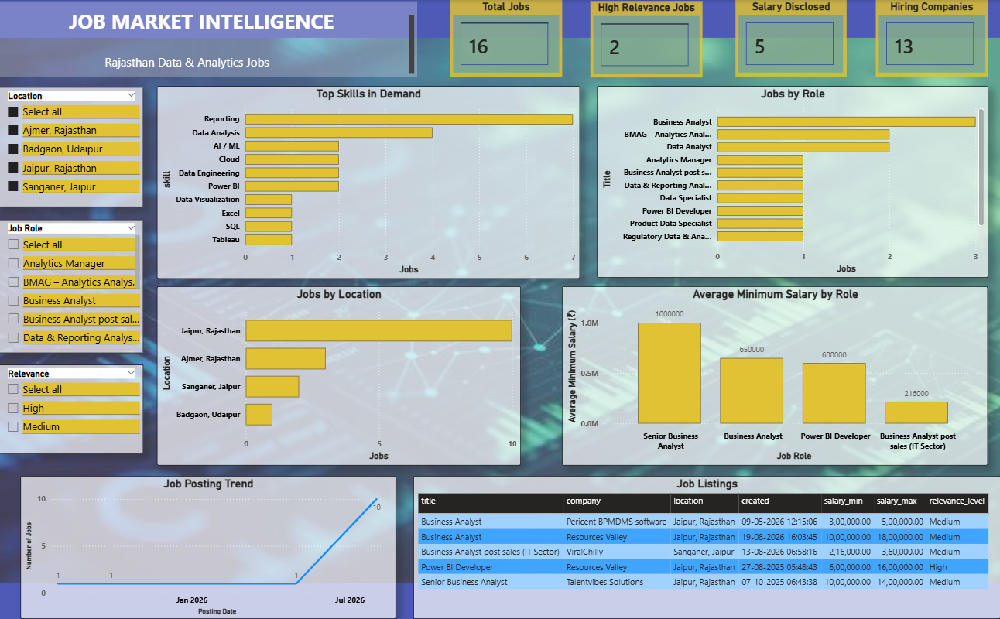
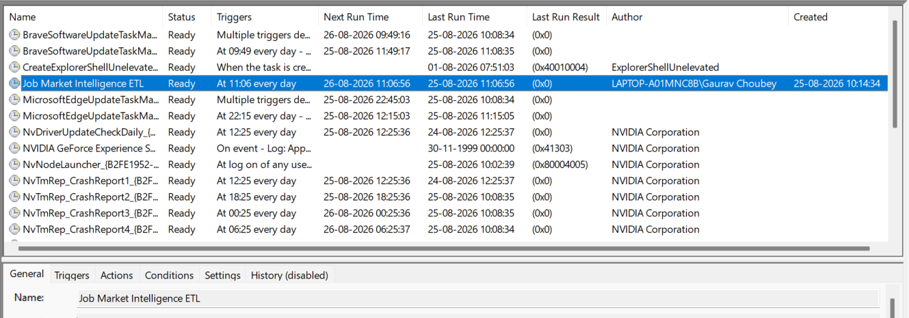

# Automated Job Market Intelligence Dashboard

An end-to-end data analytics project built to analyze Rajasthan's Data & Analytics job market using job listings collected through the Adzuna API.

## Architecture


## Dashboard Preview



## Project Overview

This project moves beyond a static dataset and demonstrates an automated analytics workflow.

The pipeline:

- Collects job listings from the Adzuna API
- Removes duplicate job postings
- Cleans and structures raw data
- Filters relevant and recent jobs
- Extracts technical skills using NLP-based pattern matching
- Stores processed data in MySQL
- Feeds the data into Power BI
- Runs automatically using Windows Task Scheduler

## Key Dashboard Insights

The Power BI dashboard covers:

- Total job postings
- High-relevance jobs
- Salary-disclosed jobs
- Hiring companies
- Top skills in demand
- Jobs by role
- Jobs by location
- Average minimum salary by role
- Job posting trends
- Detailed job listings

## Automation

The ETL pipeline is scheduled using Windows Task Scheduler.



The automated workflow is:

```text
Windows Task Scheduler
        ↓
Python ETL Pipeline
        ↓
Adzuna API
        ↓
Data Cleaning & NLP
        ↓
MySQL
        ↓
Power BI
